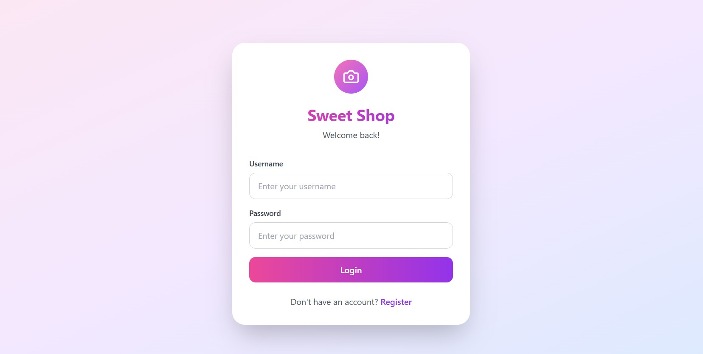
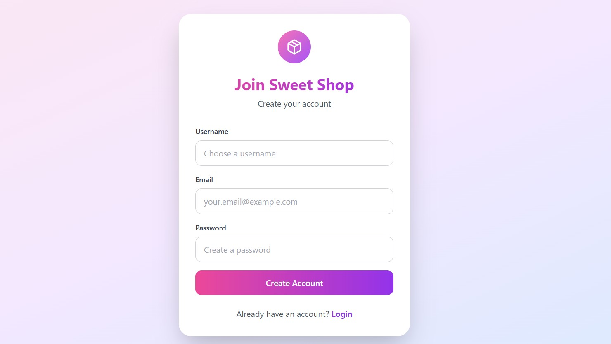
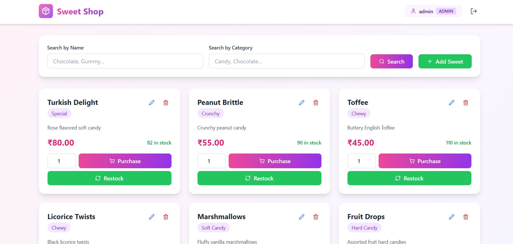
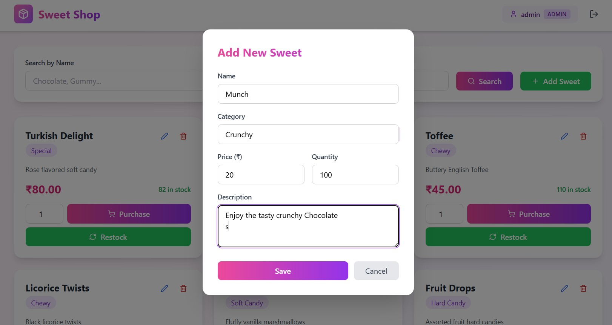
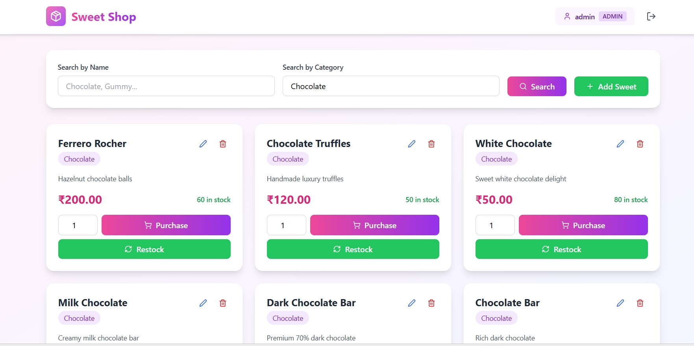
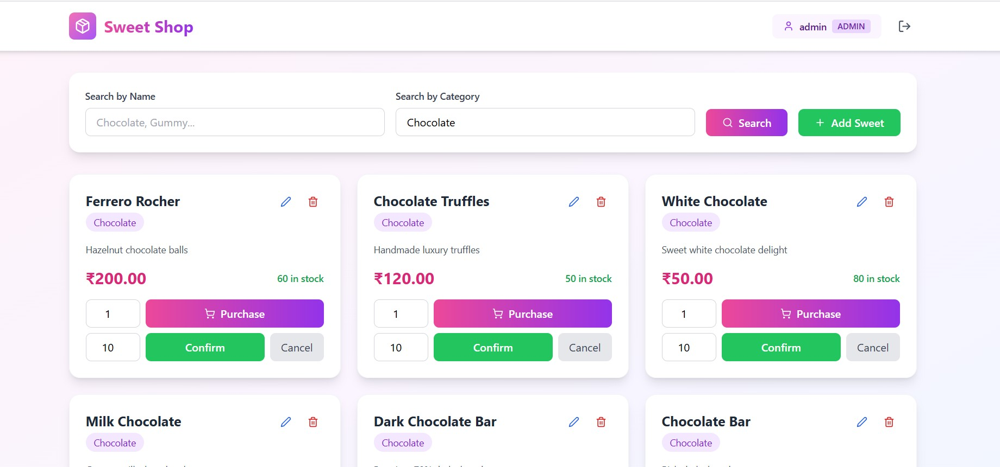
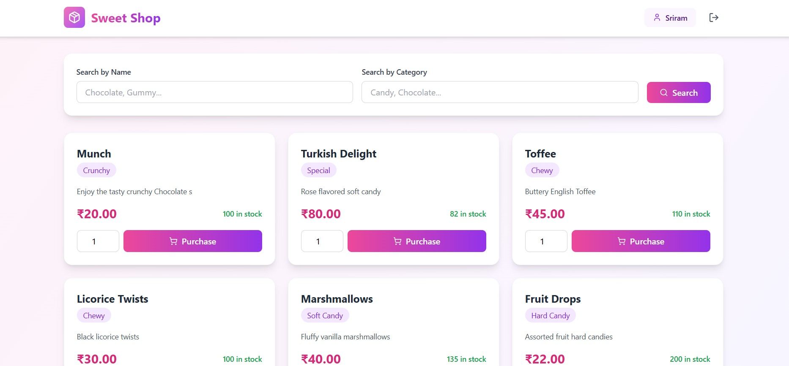

# 🍬 Sweet Shop Management System

A full-stack web application for managing a sweet shop with secure user authentication, inventory management, and admin controls.  
Built using **Django REST Framework** and **React + Tailwind CSS**, following **Test-Driven Development (TDD)** principles.

---

## 🎯 Features

- 🔐 **User Authentication**
  - Register & Login using JWT tokens
- 🍭 **Browse Sweets**
  - View all available sweets with price, category & stock
- 🔍 **Search & Filter**
  - Search by sweet name or category
- 🛒 **Purchase Sweets**
  - Buy sweets and automatically update inventory
- 🧑‍💼 **Admin Features**
  - Add new sweets
  - Edit sweets
  - Delete sweets
  - Restock inventory
- 📱 **Responsive UI**
  - Clean and modern design using Tailwind CSS

---

## 🛠️ Tech Stack

### Backend
- Django 4.2.7
- Django REST Framework
- Django Simple JWT
- SQLite
- pytest

### Frontend
- React 18
- Vite
- Tailwind CSS
- Lucide React
- Fetch API

---

## 📦 Installation & Setup

### Prerequisites
- Python 3.8+
- Node.js 16+
- npm or yarn

### Backend Setup

```bash
cd backend
python -m venv venv
venv\Scripts\activate   # Windows
source venv/bin/activate # Mac/Linux
pip install -r requirements.txt
python manage.py makemigrations
python manage.py migrate
python manage.py createsuperuser
python manage.py runserver
```

Backend runs at `http://localhost:8000`

### Frontend Setup

```bash
cd frontend
npm install
npm run dev
```

Frontend runs at `http://localhost:5173`

---

## 🧪 Running Tests

```bash
cd backend
pytest -v
pytest --cov=. --cov-report=html
```

---

## 📸 Screenshots

### Login Page


### Register Page


### Admin Dashboard


### Add New Sweet


### Search & Filter


### Restock Inventory


### User Dashboard


---

## 🔑 API Endpoints

### Authentication
- POST `/api/auth/register/`
- POST `/api/auth/login/`
- POST `/api/auth/token/refresh/`

### Sweets
- GET `/api/sweets/`
- POST `/api/sweets/` (Admin)
- GET `/api/sweets/{id}/`
- PUT `/api/sweets/{id}/` (Admin)
- DELETE `/api/sweets/{id}/` (Admin)
- GET `/api/sweets/search/`
- POST `/api/sweets/{id}/purchase/`
- POST `/api/sweets/{id}/restock/` (Admin)

---

## 👥 User Roles

### User
- View sweets
- Search sweets
- Purchase sweets

### Admin
- Add, edit, delete sweets
- Restock inventory

---

## 🤖 AI Usage

AI tools were used for guidance, architecture suggestions, test case generation, and debugging.  
All logic was reviewed, understood, and implemented manually.

---

## 🚀 Deployment

### Backend (Heroku)
```bash
heroku login
heroku create sweet-shop-backend
git push heroku main
heroku run python manage.py migrate
```

### Frontend (Vercel)
```bash
npm install -g vercel
cd frontend
vercel
```

---

## 👨‍💻 Author
Sriram Balkrishnan

## 📄 License
MIT License
